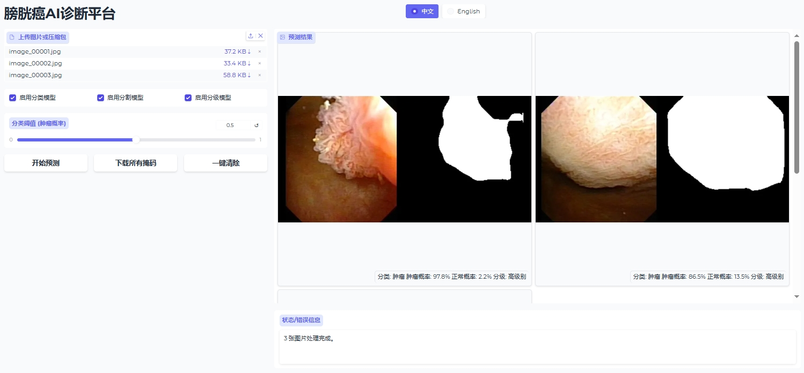

#  Bladder Tumor Analysis from Cystoscopy Images

本项目基于膀胱镜图像，旨在实现针对膀胱肿瘤的多任务智能分析。  
通过分类、分割与分级预测模型，辅助膀胱癌的早期发现和精准诊断。

---
##  在线推理平台

项目提供了一个在线平台，支持用户：

- 上传单张膀胱镜图像（`jpg/png`格式）
- 或批量上传压缩包（`zip`格式）
- 平台自动完成图像解析，执行分类、分割与分级预测，并返回结果下载。
  
---
##  平台介绍
### Task 1: 肿瘤分类（Tumor Classification）
- **目标**：根据膀胱镜图像判断图像中是否存在肿瘤。
- **输出**：二分类结果（`Normal` / `Tumor`）。
- **框架**：基于EfficientNet_B0实现。
### Task 2: 肿瘤分割（Tumor Segmentation）
- **目标**：在膀胱镜图像中定位并分割出肿瘤区域。
- **输出**：每张图像对应一张掩膜（Mask），掩盖肿瘤区域。
- **框架**：基于ResNet34-UNet++实现。
### Task 3: 肿瘤分级（Tumor Grading）
- **目标**：将肿瘤图像分为Low Grade和High Grade。
- **输出**：二分类结果（'High/Low’）。
- **框架**：基于Convnext-Tiny实现。

